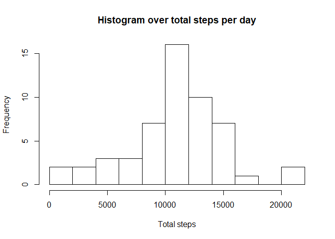
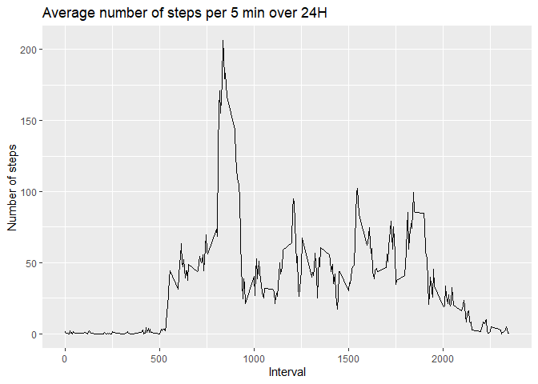
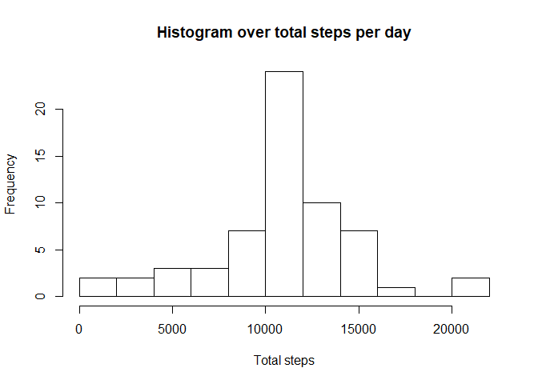

## Loading and preprocessing the data

Start by loading the required packages and the data itself.


```r
library(dplyr)
library(ggplot2)
library(lubridate)
library(lattice)

dat <- read.csv("activity.csv", na.strings = "NA", stringsAsFactors = FALSE)
```

## What is mean total number of steps taken per day?

This is calculated by first calculating the total steps taken for each day and storing it in a new data frame. The total steps are then plotted in a histogram to show the distribution, using 15 bins. 


```r
totdat <- dat %>% group_by(date) %>% summarize(total_steps = sum(steps))

hist(totdat$total_steps, breaks = 15, xlab = "Total steps", main = "Histogram over total steps per day")
```

<!-- -->

The mean and median are then calculated on the total steps per day column, using the option to remove NA entries.


```r
mean(totdat$total_steps, na.rm = TRUE)
```

```
## [1] 10766.19
```

```r
median(totdat$total_steps, na.rm = TRUE)
```

```
## [1] 10765
```

One can observe that the mean and median taken steps per day over the two months is around 10765. This indicates that the subject has healthy activity levels. 

## What is the average daily activity pattern?

Calculate average steps per interval over all days and plot the results.


```r
dat %>% 
        group_by(interval) %>%
        summarize(avg_steps = mean(steps, na.rm = TRUE)) %>%
        ggplot(aes(interval, avg_steps)) +
        geom_line() +
        labs(x = "Interval", y = "Number of steps", title = "Average number of steps per 5 min over 24H")
```

<!-- -->

From these results we can deduct that the subject has a job which demands some moving about.

The 5 minute interval, which on average across all the days in the dataset, contains the maximum number of steps is calculated.


```r
avgdat <- dat %>% group_by(interval) %>% summarize(avg_steps = mean(steps, na.rm = TRUE))

avgdat$interval[which.max(avgdat$avg_steps)]
```

```
## [1] 835
```

From the reulting time series plot together with this result we see that the subject has an increased activity level around 08:35 o'clock over the span of the two months. This could correspond to a morning commute to work, or a routine to run in the morning for some days of the week.

## Imputing missing values

Count the number of missing values for measured steps.


```r
sum(is.na(dat$steps))
```

```
## [1] 2304
```

An impute strategy of replacing missing values with the mean number of steps for that particular interval is used. Consideration was made to use mean number of steps for a particular day, but some days didn't have any valid observations and the mean was thus calculated to NaN for those specific days.


```r
means <- tapply(dat$steps, dat$interval, mean, na.rm=TRUE)

dat$steps[is.na(dat$steps)] <- means[match(dat$interval[is.na(dat$steps)], sort(unique(dat$interval)))]
```

Again, compute the total steps for each day and plot it to a histogram, but now using the data frame with imputed values instead of removing observations.


```r
totdat <- dat %>% group_by(date) %>% summarize(total_steps = sum(steps))

hist(totdat$total_steps, breaks = 15, xlab = "Total steps", main = "Histogram over total steps per day")
```

<!-- -->

Calculate mean and median steps per day for the data frame with imputed values.


```r
mean(totdat$total_steps, na.rm = TRUE)
```

```
## [1] 10766.19
```

```r
median(totdat$total_steps, na.rm = TRUE)
```

```
## [1] 10766.19
```

One can now see that the median has changed from before (but not much) but not the mean. The mean and median are now actually the same.

## Are there differences in activity patterns between weekdays and weekends?

In order to compare activity levels between weekdays and weekends, we must first extract which days are weekdays and which are weekends. This is done below and the results are stored in a new column called 'day_of_week'. We then compute the average number of steps per interval for both groups. 


```r
daydat <- mutate(dat, day_of_week = as.factor(if_else((wday(date) %in% 2:6), "weekday", "weekend")))

totdaydat <- daydat %>% group_by(day_of_week,interval) %>% summarize(avg_steps = mean(steps, na.rm = TRUE))
```

Now since we have a factor column, we can plot the data in separate panels using the lattice package


```r
xyplot(avg_steps ~ interval | day_of_week, data = totdaydat, type = "l", layout = c(1,2), xlab = "Interval", ylab = "Number of steps")
```

<!-- -->

One can observe that the overall activity is higher during the weekend, which could be related to not being at work and thus having more free time to go about. You can also observe that the peak at 08:35 o'clock is dropping during weekends, further indicating that the peak is related to the morning commute to work, or a morning run routine before work. However from looking at the data one can see that the peaks are not consistent over all weekdays, thus indicating that it is not related to a regular daily commute. The morning peaks range in a level of around 700-800 steps which indicates that the subject is actually running. Peaks at 600 or sligtly below indicates that the subject is walking.  


